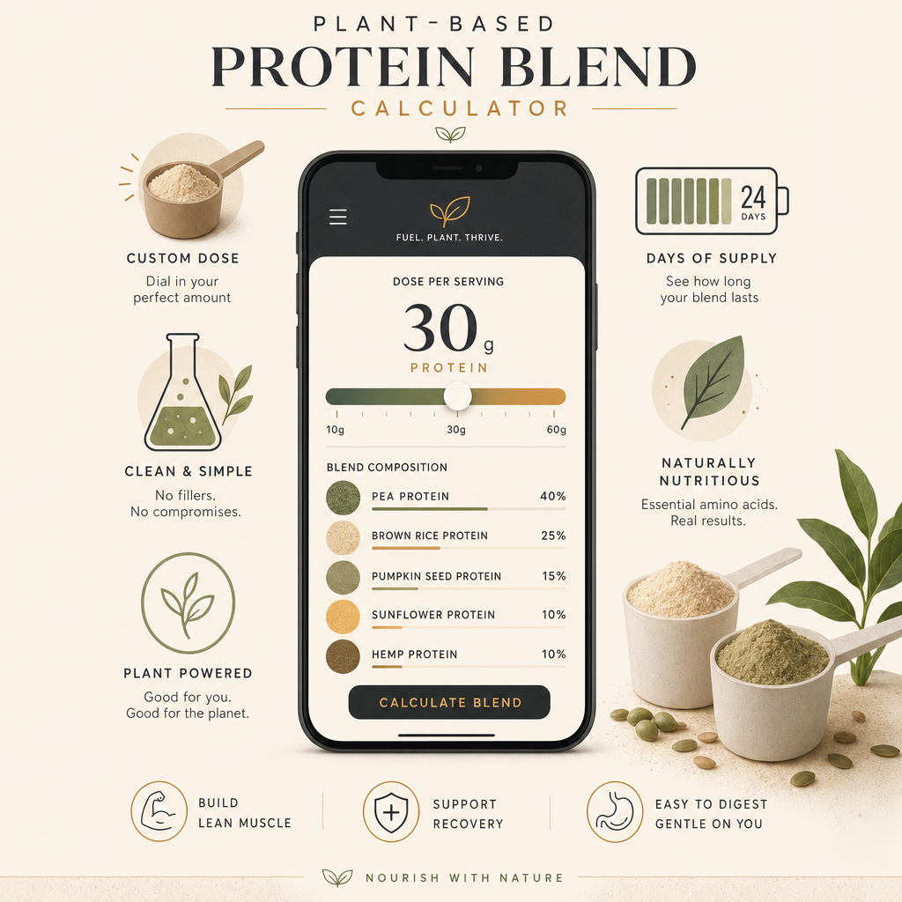

# Performance Blend Calculator (PWA)

<p align="center">
  
</p>

An installable, offline-capable Progressive Web App for calculating protein blend
batch weights, daily dosing, and supply logistics.

Built with **Vite + React + TypeScript + Tailwind CSS**, made installable via
[`vite-plugin-pwa`](https://vite-pwa-org.netlify.app/) (Workbox service worker + web manifest).

## Getting started

```bash
pnpm install          # install dependencies
pnpm dev              # start dev server (PWA enabled in dev via devOptions)
pnpm build            # type-check + production build into dist/
pnpm preview          # serve the production build locally
```

> This project uses **pnpm**. Native dependencies (`sharp`, `esbuild`) are allowlisted
> under `pnpm.onlyBuiltDependencies` in `package.json` so their build scripts run on install.

## PWA features

- **Installable** — web app manifest with name, theme color (`#353432`), and icons.
- **Offline** — the Workbox service worker precaches the app shell and assets, with a
  navigation fallback to `index.html`.
- **Auto-update** — `registerType: 'autoUpdate'` swaps in a new service worker as soon
  as an updated build is deployed.
- **iOS support** — `apple-touch-icon` and standalone web-app meta tags.

## Icons

App icons are generated from SVG sources in `scripts/` using [sharp](https://sharp.pixelplumbing.com/):

```bash
pnpm generate-icons
```

This produces `pwa-192x192.png`, `pwa-512x512.png`, `pwa-maskable-512x512.png`, and
`apple-touch-icon.png` in `public/`. Re-run it after editing `scripts/icon-source*.svg`.

## Project structure

```
index.html                 # app entry, PWA + iOS meta tags
src/main.tsx               # React bootstrap
src/App.tsx                # the calculator UI (migrated from the original .tsx)
src/index.css              # Tailwind directives
vite.config.ts             # Vite + VitePWA (manifest + Workbox) config
scripts/                   # SVG icon sources + generator
public/                    # favicon + generated PNG icons
```

## Deployment

Deploy the contents of `dist/` to any static host (Netlify, Vercel, GitHub Pages, etc.).
A service worker requires **HTTPS** (or `localhost`) to register.
